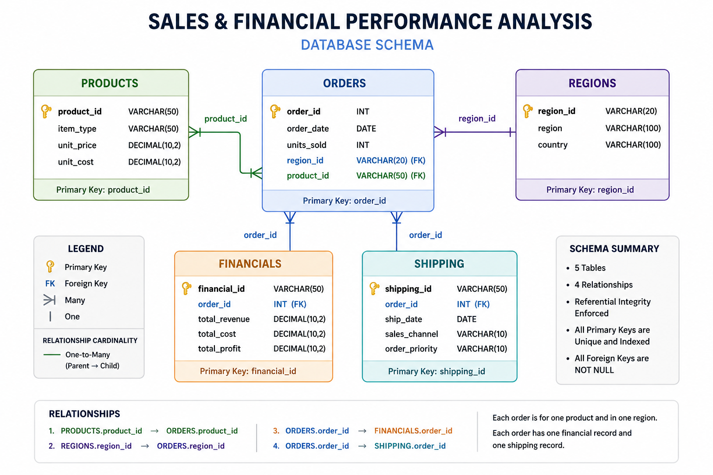

# Sales & Financial Performance Analysis

A MySQL portfolio project focused on relational database design, data validation, and business-oriented SQL analysis of sales, financial, regional, product, and shipping data.

## Project Overview

This project builds a relational sales database from multiple CSV sources and uses SQL to investigate business performance across products, regions, sales channels, and time.

The analysis answers questions such as:

- How much revenue, cost, and profit were generated?
- Which product categories contribute the most revenue?
- Which products have the strongest unit economics?
- How does performance vary across regions?
- How are online and offline sales distributed?
- How has revenue changed over time?
- Does order priority correspond to different shipping times?

## Database Schema

The database contains five related tables:

- `Products`
- `Regions`
- `Orders`
- `Financials`
- `Shipping`


### Relationships

| Parent Table | Child Table | Relationship |
|---|---|---|
| Products | Orders | `Products.product_id → Orders.product_id` |
| Regions | Orders | `Regions.region_id → Orders.region_id` |
| Orders | Financials | `Orders.order_id → Financials.order_id` |
| Orders | Shipping | `Orders.order_id → Shipping.order_id` |

Primary keys and foreign keys are enforced in MySQL to maintain referential integrity.

## Data Preparation and Validation

The SQL workflow includes:

- Database and table creation
- CSV data loading with `LOAD DATA INFILE`
- Date conversion using `STR_TO_DATE()`
- Data cleaning using `TRIM()` and `REPLACE()`
- Row-count validation
- Foreign-key relationship validation
- Duplicate-key checks
- Primary key and foreign key constraints

The loaded dataset contains:

| Table | Records |
|---|---:|
| Products | 12 |
| Regions | 185 |
| Orders | 10,000 |
| Financials | 10,000 |
| Shipping | 10,000 |

All tested relationships returned complete matches.

## SQL Analysis

### Sales and Financial Performance

The analysis calculates:

- Total units sold
- Total revenue
- Total cost
- Total profit
- Overall profit margin
- Revenue and profit by product category

### Time Analysis

Monthly performance is analyzed using:

- Year
- Month
- Revenue
- Profit
- Units sold

Year-over-year revenue growth is calculated using the `LAG()` window function.

### Product Analysis

Product economics are evaluated using:

- Unit price
- Unit cost
- Unit margin
- Margin percentage

### Regional Analysis

Performance is analyzed at both:

- Country level
- Regional level

Metrics include units sold, revenue, profit, and profit margin.

### Shipping and Sales Channel Analysis

The project compares:

- Online vs. offline orders
- Order share
- Revenue
- Profit
- Profit margin
- Average shipping time by order priority

### Advanced SQL

Advanced techniques include:

- Common Table Expressions (CTEs)
- Window functions
- `RANK()`
- `LAG()`
- Date functions
- Multi-table joins
- Revenue growth calculations

## Key Findings

The analysis produced several notable findings:

- Total revenue was approximately **$1.33 billion**.
- Total profit was approximately **$395.09 million**.
- Overall profit margin was **29.63%**.
- **Household** was the highest-revenue product category.
- **Clothes** had the highest catalog unit margin at **67.20%**.
- **Meat** had the lowest catalog unit margin at **13.56%**.
- **Europe** generated the highest regional revenue.
- **Australia & Oceania** recorded the highest regional profit margin at **30.87%**.
- Online orders represented **50.61%** of total orders, while offline sales generated slightly more revenue.
- Revenue declined by **42.55% in 2017** compared with 2016.
- Average shipping times were broadly similar across order-priority categories.

## Tools and Skills

### Tools

- MySQL
- MySQL Workbench
- GitHub

### SQL Skills

- Database design
- Relational data modeling
- Primary and foreign keys
- Data loading
- Data cleaning
- Data validation
- Multi-table joins
- Aggregations
- CTEs
- Window functions
- `RANK()`
- `LAG()`
- Date functions
- Business KPI analysis

## Project Structure

```text
sales-financial-sql-analysis/
│
├── README.md
├── sales_financial_analysis.sql
│
└── images/
    └── database-schema.png
```

## How to Run

### 1. Install MySQL

Install MySQL Server and MySQL Workbench, or use another MySQL-compatible client.

### 2. Prepare the Data

Place the required CSV files in a directory accessible to your MySQL installation.

Update the file paths in `sales_financial_analysis.sql` to match the location of your CSV files.

The script uses `LOAD DATA INFILE` to import the source data into MySQL.

> **Note:** File paths are environment-specific. The SQL script does not rely on the author's local directory structure.

### 3. Run the SQL Script

Open:

```text

sales_financial_analysis.sql

The script will:

Create the database
Create the five tables
Load the CSV data
Validate the data
Create foreign-key relationships
Execute the analytical queries
```
## Author

**Rachel Konadu Gyamfi**

Data Analyst | SQL | Python | Power BI | Excel

[LinkedIn](https://www.linkedin.com/in/rachel-konadu-gyamfi) | [GitHub](https://github.com/cyber-rachel)l
